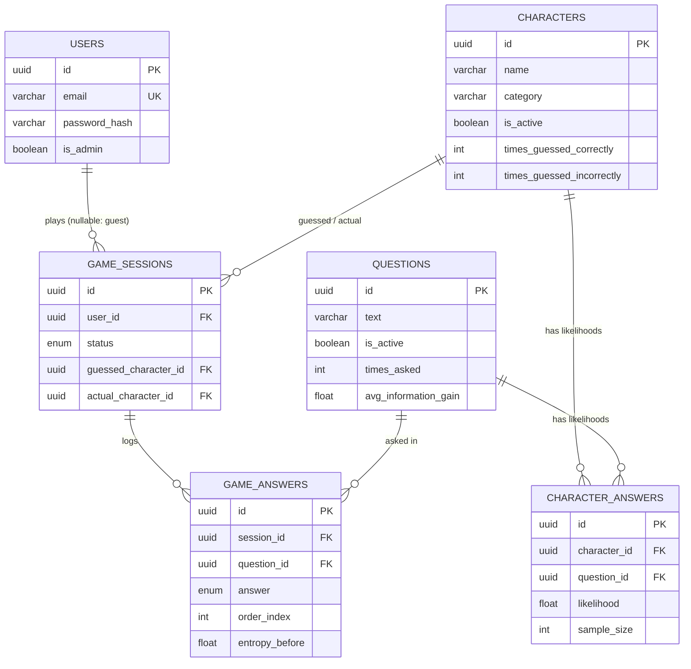

# MindGuess AI — Architecture

Production-grade Bayesian guessing engine (Akinator-style).
Stack: FastAPI · SQLAlchemy (async) · Alembic · PostgreSQL (prod) / SQLite (dev) · JWT.
Target scale: millions of completed games, thousands of concurrent sessions.

Status: reflects the implemented system as of v0.2.0. Sections marked *(planned)* are design, not code.

---

## 1. Folder Structure

```
mindguess-ai/
├── app/
│   ├── main.py                      # App factory: middleware, routers, health probes, lifespan
│   ├── config.py                    # All tunables via env (pydantic-settings)
│   ├── core/
│   │   └── logging.py               # JSON structured logs + request-ID middleware
│   ├── engine/                      # ★ Pure algorithms — zero I/O, zero framework imports
│   │   ├── constants.py             #   Answer weights, default thresholds
│   │   ├── models.py                #   GameEngineState, LikelihoodEntry, ConfidenceResult
│   │   ├── bayesian.py              #   Bayes update + renormalize + learning nudge
│   │   ├── elimination.py           #   Shannon entropy, candidate pruning
│   │   ├── confidence.py            #   Guess-trigger conditions
│   │   ├── selector.py              #   Information gain, next-question selection
│   │   └── cold_start.py            #   Smoothing, question eligibility gating
│   ├── services/                    # Use-case orchestration (owns transactions)
│   │   ├── game_service.py          #   Game loop + session rehydration
│   │   ├── auth_service.py          #   bcrypt + JWT
│   │   ├── learning_service.py      #   Post-game likelihood updates
│   │   └── session_store.py         #   SessionManager (cache-backed, TTL)
│   ├── cache/
│   │   ├── backend.py               #   CacheBackend protocol (Redis seam)
│   │   └── memory.py                #   TTL in-memory implementation
│   ├── db/
│   │   ├── models.py                #   6 core tables + users.is_admin
│   │   ├── session.py               #   Async engine/session factory
│   │   └── repositories/            #   Only layer that writes SQL
│   ├── api/
│   │   ├── deps.py                  #   DI: db, services, current_user, require_admin
│   │   ├── routes/                  #   game.py · auth.py · admin.py (thin controllers)
│   │   └── schemas/                 #   Pydantic request/response contracts
│   └── workers/
│       └── session_cleanup.py       #   Abandons stale sessions (30 min)
├── migrations/                      # Alembic: 001 initial, 002 users.is_admin
├── tests/
│   ├── unit/                        # Engine math (TDD §2.6 golden fixture), cache
│   └── integration/                 # HTTP flows: full games, rehydration, RBAC
├── scripts/seed_db.py               # Dev seed data
├── frontend/                        # React + Three.js client (out of backend scope)
└── docs/ARCHITECTURE.md
```

**Dependency rule:** imports point downward only — `api → services → (engine | cache | db)`.
The engine imports nothing from any other layer. Repositories are the only SQL surface.
Services are the only place transactions commit.

---

## 2. Database Schema

All tables use UUID primary keys and timezone-aware timestamps.

### users
| Column | Type | Constraints |
|---|---|---|
| id | UUID | PK |
| email | VARCHAR(255) | UNIQUE, NOT NULL |
| password_hash | VARCHAR(255) | NOT NULL (bcrypt) |
| username | VARCHAR(100) | NOT NULL |
| is_admin | BOOLEAN | NOT NULL, default false |
| created_at | TIMESTAMP | server default now() |

### characters
| Column | Type | Constraints |
|---|---|---|
| id | UUID | PK |
| name | VARCHAR(255) | NOT NULL |
| category | VARCHAR(100) | NOT NULL (real_person, fictional, …) |
| image_url | VARCHAR(512) | NULLABLE |
| is_active | BOOLEAN | NOT NULL, default true — false = pending moderation or retired |
| times_guessed_correctly | INTEGER | denormalized counter |
| times_guessed_incorrectly | INTEGER | denormalized counter |
| created_at | TIMESTAMP | |

Index: `ix_characters_is_active`.

### questions
| Column | Type | Constraints |
|---|---|---|
| id | UUID | PK |
| text | VARCHAR(512) | NOT NULL |
| category | VARCHAR(100) | NULLABLE (grouping / don't-know diversification) |
| is_active | BOOLEAN | NOT NULL, default true |
| times_asked | INTEGER | denormalized counter |
| avg_information_gain | FLOAT | NULLABLE, rolling average of realized IG |
| created_at | TIMESTAMP | |

Index: `ix_questions_is_active`.

### character_answers — the likelihood matrix L(C, Q)
| Column | Type | Constraints |
|---|---|---|
| id | UUID | PK |
| character_id | UUID | FK → characters.id |
| question_id | UUID | FK → questions.id |
| likelihood | FLOAT | 0.0–1.0, learned P(answer=yes \| character) |
| sample_size | INTEGER | games that informed this value (drives smoothing) |
| updated_at | TIMESTAMP | |

Constraints: **UNIQUE (character_id, question_id)**; index on `question_id`.
Largest table: |C| × |Q| rows. Bulk-loaded once per session start.

### game_sessions
| Column | Type | Constraints |
|---|---|---|
| id | UUID | PK |
| user_id | UUID | FK → users.id, NULLABLE (guest play) |
| status | ENUM | in_progress · guessed_correct · guessed_incorrect · abandoned |
| guessed_character_id | UUID | FK, NULLABLE |
| actual_character_id | UUID | FK, NULLABLE |
| questions_asked_count | INTEGER | |
| started_at / ended_at | TIMESTAMP | ended_at NULLABLE |

Index: `ix_game_sessions_status` (cleanup job scans `(status, started_at)`).

### game_answers — append-only replay log (source of truth for live state)
| Column | Type | Constraints |
|---|---|---|
| id | UUID | PK |
| session_id | UUID | FK → game_sessions.id |
| question_id | UUID | FK → questions.id |
| answer | ENUM | yes · probably_yes · dont_know · probably_no · no |
| order_index | INTEGER | UNIQUE with session_id |
| entropy_before | FLOAT | analytics/debugging |
| created_at | TIMESTAMP | |

Index: `ix_game_answers_session_id`; UNIQUE `(session_id, order_index)`.

---

## 3. Entity Relationship Diagram



---

## 4. Engine Architecture

The engine is a pure-function library over plain dataclasses. It never touches
the network, database, or framework — which is why every algorithm is unit-tested
against the TDD §2.6 worked example in milliseconds.

```
GameEngineState
├── character_ids: [UUID]                  # active candidate pool
├── probabilities: {UUID: float}           # P(C), always sums to 1
├── likelihoods: {(char,question): L,n}    # loaded matrix + sample sizes
├── used_question_ids: set                 # never re-ask
├── questions_asked / consecutive_dont_know
└── pre_elimination_top                    # fallback if pool empties

Module graph (pure, one-directional):
constants → models → cold_start → bayesian → elimination → confidence → selector
```

| Module | Responsibility |
|---|---|
| `cold_start` | `smooth_likelihood`: shrink extreme L toward 0.5 when sample_size < 10; `is_question_eligible`: gate untested questions out of IG |
| `bayesian` | `bayesian_update` (posterior + renormalize), `apply_learning_update` (post-game nudge) |
| `elimination` | `entropy` (Shannon), `eliminate_candidates` (floor 0.0005 OR 1000× below top; empty-pool fallback) |
| `confidence` | 4 stop conditions: conf ≥ 0.85 · (conf ≥ 0.6 ∧ margin ≥ 0.4) · 25 questions · ≤ 1 candidate |
| `selector` | expected-entropy simulation over 5 answers, IG argmax, tie-break by sample_size, `process_answer` turn pipeline |

---

## 5. Bayesian Algorithm Flow

Answer weights: yes 1.0 · probably_yes 0.75 · dont_know 0.5 · probably_no 0.25 · no 0.0.

```
User answers question Q with weight w
        │
        ▼
for each active character C:
    match = 1 − |L(C,Q) − w|            # likelihood_match: 1 = perfect agreement
    P_new(C) = P(C) × match
        │
        ▼
renormalize:  P(C) = P_new(C) / Σ P_new  (if Σ = 0 → reset uniform: contradictions)
        │
        ▼
eliminate:    drop C where P(C) < 0.0005  OR  P(C) < top/1000
              (if pool empties → restore pre-elimination top at P=1.0)
        │
        ▼
confidence check (Section 4 table) ──► guess  |  ask next question (Section 6)
```

Worked example (golden test fixture): 4 characters at P=0.25, "Is this person a
scientist?" answered *Yes* → Einstein 0.617, Musk 0.357, Messi/Ronaldo 0.013.

---

## 6. Entropy Question Selection Flow

```
H(current) = − Σ P(C)·log₂ P(C)         over active candidates
        │
        ▼
for each unused, eligible question Q:
    for each answer a in the 5 options:
        P(a) = Σ_C  P(C) · likelihood_match(C, Q, a)
        simulate bayesian_update(Q, a) → hypothetical distribution → H(a)
    Expected_H(Q) = Σ_a  P(a) · H(a)
    IG(Q) = H(current) − Expected_H(Q)
        │
        ▼
next = argmax IG(Q)
    tie (ΔIG < 0.001) → prefer higher Σ sample_size (more reliable estimate)
    all questions gated by cold-start? → relax eligibility
    no unused questions left → force ready_to_guess (best-so-far)
```

Complexity per turn: **O(active_candidates × unused_questions × 5)**.
Elimination shrinks the candidate pool every turn, so cost decays as the game progresses.

---

## 7. Learning Pipeline

Runs only after a game reaches a terminal state — never in the question loop.

```
guess/confirm(correct=true)                guess/confirm(correct=false, actual_id)
        │                                          │
        ▼                                          ▼
target = guessed character                 target = actual character user picked
        │                                          │
        └────────────────┬─────────────────────────┘
                         ▼
        replay game_answers (order_index ASC):
            L_new(C*,Q) = L_old + 0.07 × (w_answer − L_old)     # clamped [0,1]
            sample_size += 1
        update character guess counters
        update questions.avg_information_gain
            (realized ΔH between consecutive answers, rolling average)

character not in DB at all
        │
        ▼
POST /game/suggest-character → created with is_active=false
        → admin reviews via PATCH /admin/characters/{id} (is_active=true)
        → spam never pollutes the model
```

Cold-start protections: new questions default L=0.5 for everyone; questions enter
IG selection only after minimum recorded samples; low-sample likelihoods are
smoothed toward 0.5 so one fluke answer cannot distort the model.

---

## 8. Session Lifecycle

```
POST /game/start
   │  DB row: game_sessions(status=in_progress)
   │  Cache: LiveSession {engine state, pending question} (TTL 30 min)
   ▼
ASKING ──/game/answer──► GameAnswer appended (audit log) ──► confidence check
   │            ▲                                                │
   │            └── next question ◄──────────────── not confident┘
   ▼ confident / budget / exhausted
READY_TO_GUESS ──/game/guess──► guessed_character_id set
   ▼
/game/guess/confirm
   ├─ correct=true  → status=guessed_correct, learning job, cache deleted
   ├─ correct=false + actual → learning, guessed char removed from pool,
   │                            resume ASKING (or READY if nothing left to ask)
   └─ character missing → /game/suggest-character → guessed_incorrect + moderation

30 min inactivity → cleanup worker → status=abandoned (excluded from learning)
```

**Rehydration (stateless-server property):** the cache entry is disposable. On any
cache miss — restart, new worker, TTL eviction — the service replays `game_answers`
through the engine, rebuilds identical state, re-caches it, and the game continues.
Idempotency guard: re-submitting the last answered question returns current state
instead of an error; `GET /game/{id}/state` lets clients resync at any time.

---

## 9. REST API Map

| Method | Path | Auth | Purpose |
|---|---|---|---|
| POST | /auth/register | — | Create account, returns JWT |
| POST | /auth/login | — | Returns JWT |
| POST | /game/start | optional JWT | New session (guest or user-bound), first question |
| POST | /game/answer | session-scoped | Submit answer → next question or ready_to_guess |
| GET | /game/{session_id}/state | session-scoped | Resync: current question, confidence, status |
| POST | /game/guess | session-scoped | Engine reveals top candidate |
| POST | /game/guess/confirm | session-scoped | Correct/incorrect (+actual) → learning / resume |
| POST | /game/suggest-character | session-scoped | Submit missing character for moderation |
| GET | /characters | — | Paginated list (feeds reveal picker + admin) |
| GET | /questions | — | Paginated list with effectiveness stats |
| GET | /statistics | — | Games, accuracy, most-asked, weakest characters |
| POST | /admin/characters | **admin JWT** | Create character |
| PATCH | /admin/characters/{id} | **admin JWT** | Update / activate (moderation approve) / retire |
| POST | /admin/questions | **admin JWT** | Create question |
| PATCH | /admin/questions/{id} | **admin JWT** | Update / retire |
| GET | /health | — | Liveness probe |
| GET | /health/ready | — | Readiness probe (checks DB) |

Errors: services raise typed errors mapped to 400/401/403/404/409/503; every
response carries `X-Request-ID` correlating with JSON logs.

---

## 10. Performance Strategy

| Concern | Approach |
|---|---|
| IG computation | In-process, in-memory per session. 5K chars × 500 questions ≈ 12.5M float ops worst case (ms range). Candidate elimination decays cost per turn |
| Likelihood loading | Single bulk query per session start over the UNIQUE (character_id, question_id) index |
| Hot path purity | No LLM, no learning, no aggregate queries during the ask→update→decide loop |
| Stats reads | Denormalized counters (times_asked, guess counters) — no COUNT(*) scans in game flow |
| Write pattern | game_answers is append-only, one row per turn; sessions row updated in place |
| Next lever *(planned)* | numpy vectorization of the C×Q matrix behind the same engine interface (10× catalog growth) |

## 11. Caching Strategy

| Layer | Now | Later |
|---|---|---|
| Live sessions | In-memory TTL cache (30 min) behind `CacheBackend` protocol | Redis, same protocol — shared across workers, fewer replays |
| Cache-miss policy | **Rehydrate from game_answers replay** — cache is never the source of truth | unchanged (this is what makes Redis optional) |
| Likelihood matrix *(planned)* | loaded per session start | per-process cache keyed by data-version, invalidated by learning job |
| Expiry | lazy on read + periodic purge in cleanup worker | Redis native TTL |

## 12. Future Scaling Plan

Phase 1 — single node (current): FastAPI + PostgreSQL + in-memory cache. Handles
thousands of games/day comfortably; verified game loop in single-digit ms on dev data.

Phase 2 — multiple workers: uvicorn workers or replicas behind a load balancer.
Rehydration already makes workers interchangeable; add Redis to cut replay frequency;
move the learning job and cleanup into a dedicated worker process (task queue).

Phase 3 — millions of games: PostgreSQL read replicas (statistics/admin reads off
the primary), archive terminal sessions older than N months, numpy-vectorized engine,
rate limiting at the edge, Prometheus metrics + tracing, CDN for character images.

Known deferred items: Redis backend, rejected-guess tracking table (rehydration
currently cannot re-exclude a rejected candidate after cache loss — self-corrects
via resync), rate limiting, metrics endpoint.
